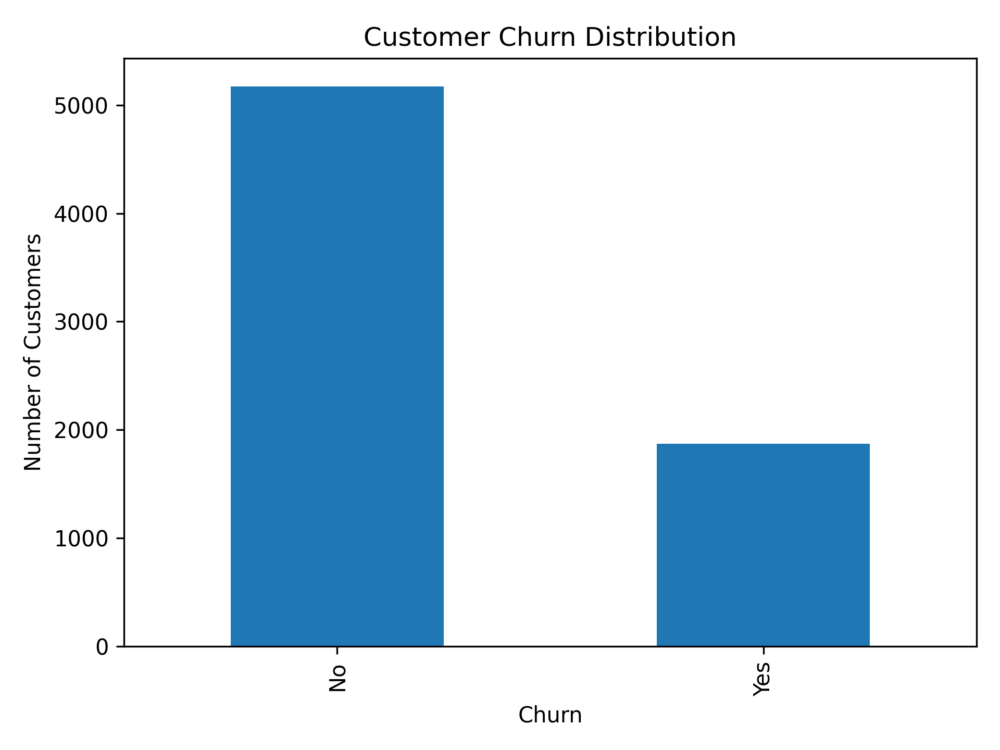
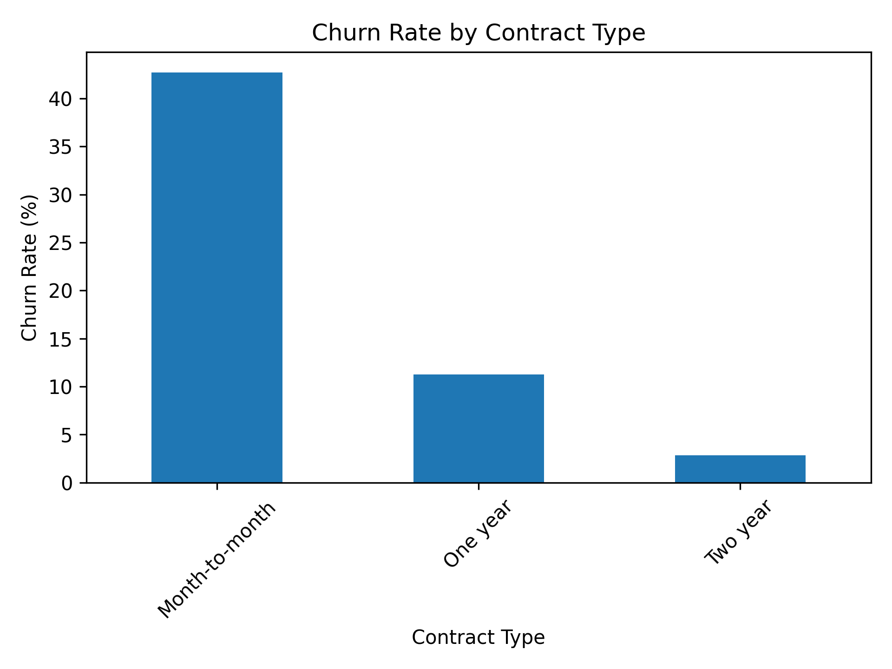
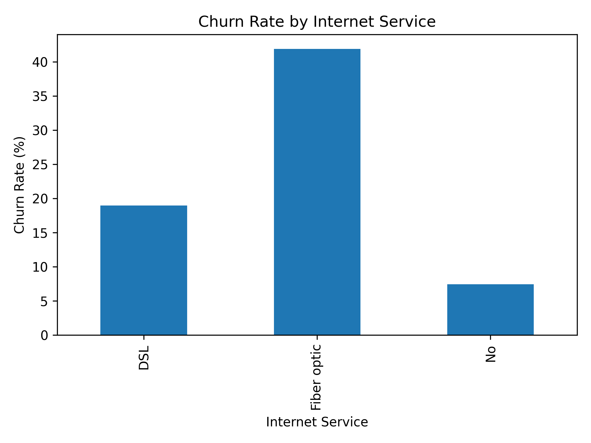
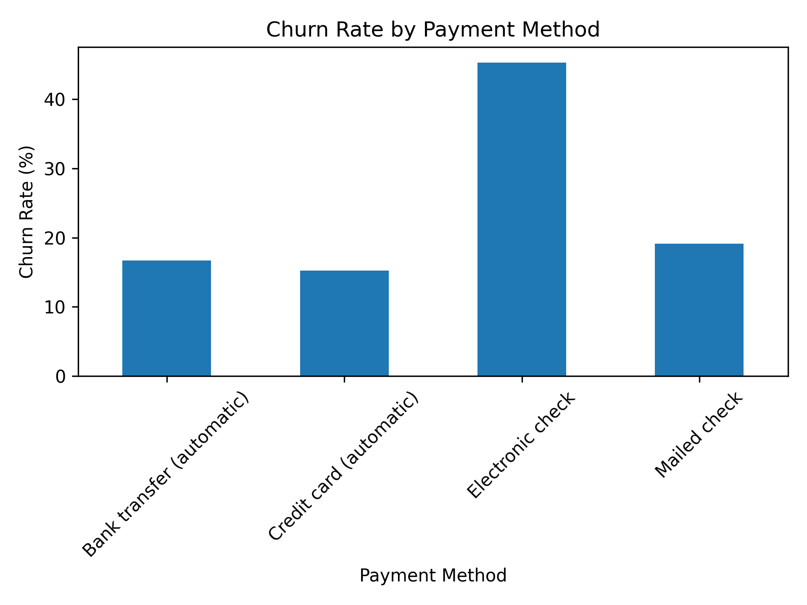
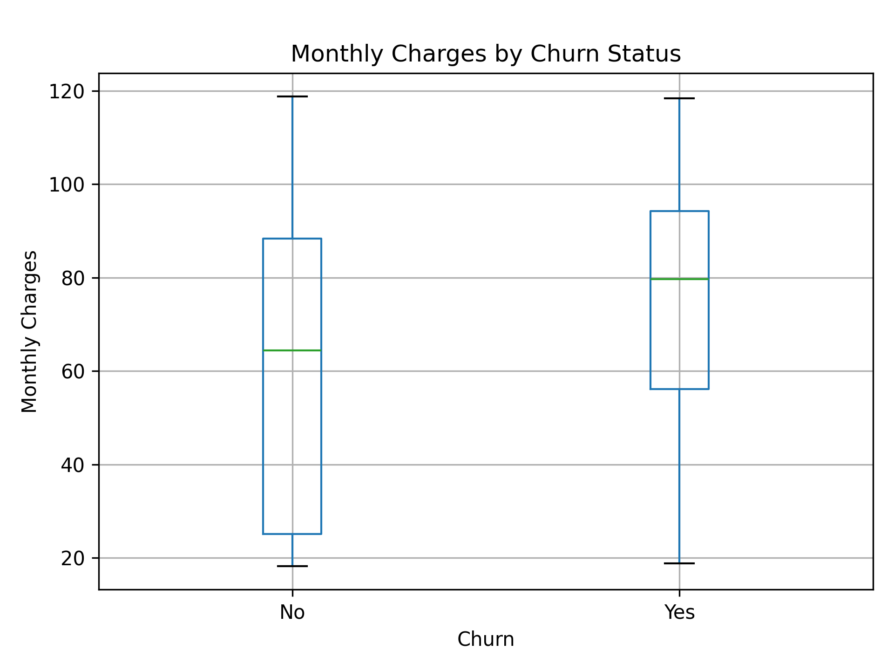

# Customer Churn Prediction

## Project Overview

Customer churn is a major challenge for subscription-based businesses. This project analyzes customer behavior and builds machine learning models to identify customers who are likely to churn.

The project combines exploratory data analysis, feature engineering, machine learning, model evaluation, and business recommendations to support proactive customer-retention decisions.

## Objectives

- Understand customer characteristics associated with churn
- Explore patterns in customer demographics, services, contracts, and billing
- Identify factors associated with higher churn rates
- Build machine learning models to predict customer churn
- Compare model performance using multiple evaluation metrics
- Translate analytical findings into actionable customer-retention strategies

## Dataset

The project uses a telecommunications customer churn dataset containing customer demographic, service, contract, and billing information.

The dataset is stored in:

`data/Telco_customer_churn.xlsx`

## Tools & Technologies

- Python
- Pandas
- NumPy
- Matplotlib
- Seaborn
- Scikit-learn
- Jupyter Notebook
- Git & GitHub

## Project Workflow

1. Data loading
2. Data inspection and cleaning
3. Exploratory data analysis
4. Churn analysis
5. Feature selection
6. Train-test split
7. Feature preprocessing
8. Machine learning model development
9. Model evaluation
10. Model comparison
11. Business insights
12. Customer-retention recommendations

## Exploratory Data Analysis

The analysis examines churn across several important customer characteristics, including:

- Contract type
- Internet service
- Payment method
- Senior citizen status
- Tech support
- Online security
- Monthly charges

## Key Findings

### Internet Service

Fiber optic customers show substantially higher churn than DSL customers.

### Contract Type

Customers on shorter-term contracts are more likely to churn than customers on longer-term contracts.

### Payment Method

Electronic check customers show the highest churn rate among the payment methods analyzed.

### Senior Citizens

Senior citizens have a considerably higher churn rate than non-senior customers.

### Tech Support

Customers without tech support have substantially higher churn than customers who have the service.

### Online Security

Customers without online security show a considerably higher churn rate.

### Monthly Charges

Customers who churn generally have higher monthly charges, indicating that pricing and perceived value may influence retention.

## Machine Learning Models

Three classification models were evaluated:

- Logistic Regression
- Decision Tree
- Random Forest

## Model Comparison

| Model | Accuracy | Precision | Recall | F1-Score | ROC-AUC |
|---|---:|---:|---:|---:|---:|
| Logistic Regression | 0.802 | 0.644 | 0.570 | 0.604 | 0.849 |
| Decision Tree | 0.794 | 0.616 | 0.596 | 0.606 | 0.835 |
| Random Forest | 0.807 | 0.668 | 0.543 | 0.598 | 0.853 |

The models were evaluated using Accuracy, Precision, Recall, F1-Score, and ROC-AUC.

For churn prediction, Recall, F1-Score, and ROC-AUC are particularly important because failing to identify a customer who is actually going to churn can result in a missed retention opportunity.

## Confusion Matrix

The Logistic Regression confusion matrix demonstrates the importance of false negatives in churn prediction.

False negatives represent customers who actually churned but were predicted as retained. These customers may be missed by proactive retention campaigns.

## Visualizations

### Customer Churn Distribution



### Churn Rate by Contract Type



### Churn Rate by Internet Service



### Churn Rate by Payment Method



### Monthly Charges by Churn Status



## Business Recommendations

Based on the analysis, the following retention strategies could be considered:

- Target high-risk customers with proactive retention campaigns
- Provide incentives for customers to move toward longer-term contracts
- Investigate pricing and value perception among high-charge customers
- Improve support availability for customers without technical support
- Review the customer experience of fiber optic users
- Develop targeted retention offers for electronic-check customers
- Provide additional support and engagement for higher-risk senior customers
- Promote security and support services as part of customer retention packages

## Repository Structure

```text
Customer-Churn-Prediction/
│
├── data/
│   └── Telco_customer_churn.xlsx
│
├── notebooks/
│   └── customer_churn_analysis.ipynb
│
├── visuals/
│   ├── churn_by_contract.png
│   ├── churn_by_internet_service.png
│   ├── churn_by_payment_method.png
│   ├── churn_distribution.png
│   └── monthly_charges_by_churn.png
│
├── .gitignore
└── README.md